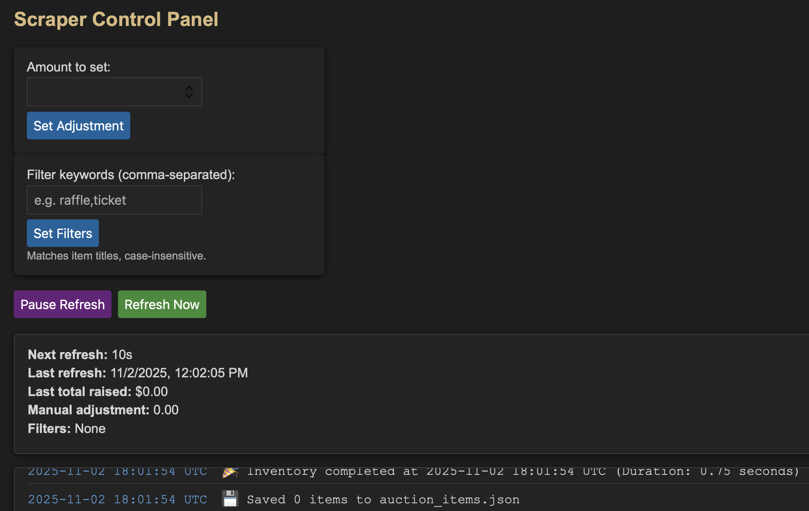

# 32datasources - Convert your auction data into JSON!



32datasources is a Python service that continuously gathers data from your 32auctions listing, stores the latest snapshot in `auction_items.json`, and exposes a live control panel with manual overrides.

## Features
- Service that collects item metadata and total raised value on a configurable cadence.
- Control panel (served on port 8081) with:
  - Real-time log stream
  - Live status including last refresh, manual adjustment, and next refresh countdown
  - Buttons to pause/resume the refresh loop or trigger an immediate refresh
  - Manual adjustment field to tweak the reported total
  - Text filter to exclude items from the JSON file

## Getting Started
1. Install dependencies:
   ```bash
   pip install -r requirements.txt
   ```
2. Launch the service:
   ```bash
   python3 scrape_auction.py
   ```
3. Open the control panel in a browser at [http://localhost:8081/](http://localhost:8081/).

Data is written to `auction_items.json` in the project root so other processes can consume it.

## Notes
- A auth token is required to grab the total raised
- Runs great in docker:
    ```bash
    docker build -t 32datasources .
    docker run --rm -p 8081:8081 --name 32datasources 32datasources
    ```